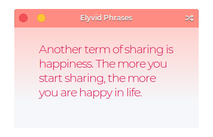

  

<h1 align="center">Elyvid</h1>

## Get Wishes and Messages from this phrases teller

Do you need a push? Do you feel lonely? Do you tired? Discover the lucky message for you and more with Elyvid, the motivational random teller.

## Made for [elementary OS](https://elementary.io)

Elyvid is designed and developed on and for [elementary OS](https://elementary.io).

**Note:** We hope Elyvid available soon on elementary OS Juno AppCenter.

Versions of Elyvid may have been built and made available elsewhere by third-parties. These builds may have modifications or changes and **are not provided nor supported by me**. The only supported version is distributed via on [GitHub.](https://github.com/HeribertoKubuntu/Elyvid)

## Developing and Building

If you want to hack on and build Elyvid yourself, you'll need the following dependencies:

* libgtk-3-dev
* meson
* valac

Run `meson build` to configure the build environment and run `ninja test` to build and run automated tests

    meson build --prefix=/usr
    cd build
    ninja test

To install, use `ninja install`, then execute with `com.github.heribertokubuntu.elyvid`

    sudo ninja install
    com.github.heribertokubuntu.elyvid

-----

